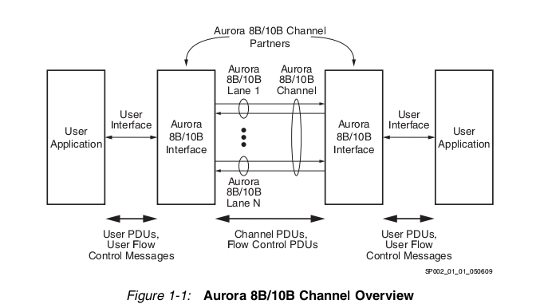

# Aurora 8B/10B

The Aurora 8B/10B is a scalable high-speed serial protocol aimed to move data
from point-to-point.
This Aurora is protocol-independent and can be used to transport industry and
standard protocols, such ETH, TCP/IP, or propietary protocols.

> The aurora 8B/10B protocol is an open standard and is available for implementation
without restriction.

This protocol does NOT define the following; it's assumed that these features
will be handled by higher-level protocols.
* Error detection and recoverz.
* Data switching, the aurora protocol does not define an addressing scheme,
therefore cannot support link layer multiplexing or switching.

## The Aurora 8b/10b channel

The communication is between two called "channel partners", which commnicate
across an Aurora 8B/10B channel, which consist of one or more Aurora 8B/10B
lanes. Each of those lanes is a full-duplex serial data connection.

Data flow consists of the transfer of user PDUs and user flow control messages
between the user application and the Aurora interface, and the transfer of
channel PDUs and flow control PDUs across the aurora channel. The format of the
this two types of flow control PDUs are defined in this document.

## Data Transmission and reception

The aurora protocol uses a symbol-based method, the minimum unit of information
that is transferred across an Aurora channel is two symbols, called symbol-pair.
The information on an Aurora channel or lane always comprisas multiple symbol-
pairs.

### Data Ordering

### Transmission Scheduling

###
